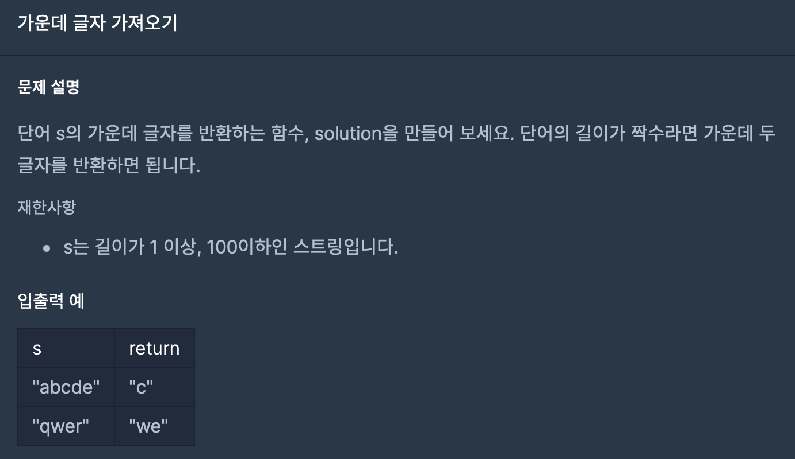

## 문제



어떤 문자열이 있으면 딱 가운데 글자를 반환해야하는 문제입니다.

글자수에 따라서 경우를 나누는 것이 중요할 것 같습니다.

## 코드

```python
def solution(s):
    l = len(s)
    a = int(l/2-0.5)
    if l % 2 == 0:
        answer = s[(l//2-1):(l//2+1)]
    else:
        answer = s[a]
    return answer
```

일단 l에 글자길이를 저장하고 글자수가 짝수라면 (l//2-1):(l//2+1)을 해서 

가운데 두글자를 출력했습니다.

만약 홀수라면 글자수를 2로 나눈 후에 반내림을 해주고(   ex)5글자면 s[2]가 출력 되어야하니까.    )

거기서 s[a]를 answer에 저장해서 가운데 글자를 출력했습니다.

```python
def string_middle(str):
    # 함수를 완성하세요

    return str[(len(str)-1)//2:len(str)//2+1]
```

사실 그냥 첫번째 if의 식으로만 해줬어도 성립이 되네요.

좀만 더생각했으면 한줄코딩 가능 할 뻔 했습니다 ㅎㅎ

