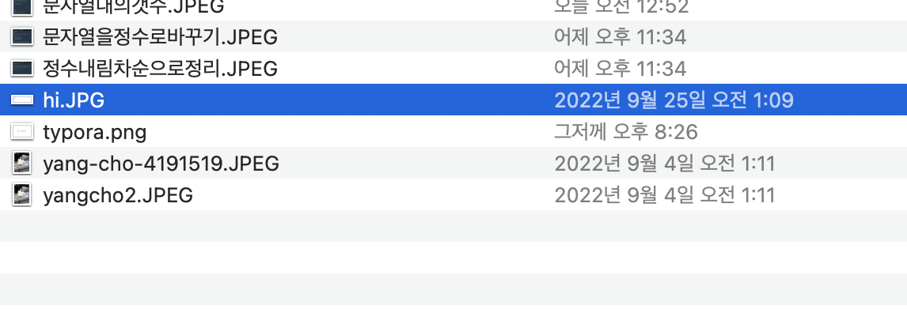

## 문제





각 자리수를 내림차순으로 재배치하는 문제입니다.

## 코드


```python
def solution(n):
    a = list(str(n))
    a.sort(reverse = True)
    answer = int("".join(a))
    return answer
```

일단 정수를 str으로 변환해서 list로 만들어 줬습니다. ( 134 -> ['1','2','3'] )

그 후에 **sort(reverse = True)**를 이용해서 내림차순을 해줬습니다. (string이여도 내림차순이 가능합니다.)

**join**을 이용해서 리스트를 하나의 문자열을 만들어준 후 형 변환으로 리턴했습니다. 


이렇게 푸신 분도 계십니다. 

```python

def solution(n):
    answer = ''
    lst = []

    while n > 0:
        r = n % 10
        n = n // 10
        lst.append(r)

    lst.sort()
    lst.reverse()

    for j in range(0, len(lst)):
        answer += str(lst[j])

    return int(answer)
```

자리수를 분리해주는 코드를 이용해서 푸셨고 

**join**이 아니라 빈 문자열에 str(lst)를 더해주어서 하나의 문자열을 만들었습니다. 


```
def solution(n):
    return int("".join(sorted(list(str(n)), reverse=True)));
```

이렇게 한 줄로 푸신 분도 계시던데 저도 언젠간....