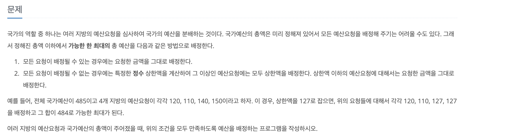

## 문제



```python
# 2512 (이분탐색)

n = int(input())  
# 지방의 수
requests = list(map(int,input().split()))
# 지방마다의 예산
total_budget = int(input()) 
# 사용할 수 있는 총 예산

# 상한액이 upper_bound일때 필요예산을 계산해주는 함수

def calculate_needed_budget(upper_bound : int):
    needed_budget = 0
    for request in requests:
        needed_budget += min(request,upper_bound)
    return needed_budget

# # 이분탐색을 수행하는 메인 로직 # #

low = 0
high = max(requests) # list requests에서 가장 큰수
good_bound = 0       # 아직모름(초기화)

while low <= high:
    mid = (low+high) // 2 # low와 high의 중간값
    
    if calculate_needed_budget(mid) <= total_budget:
        good_bound = mid
        low = mid+1
    else:
        high = mid - 1

# 최댓값 출력

answer = 0
for request in requests:
    given = min(request,good_bound)
    
    answer = max(given,answer)
    
print(answer)
```


