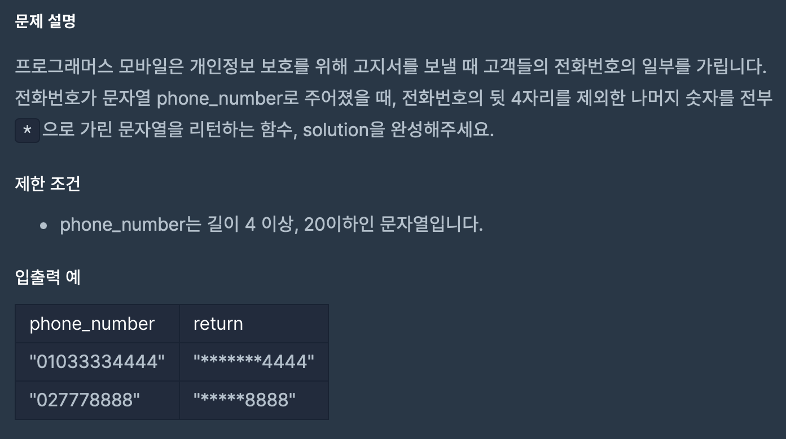

## 문제



간단히 말하자면, 뒤의 4자리만 냅두고 나머지는 *로 바꾸라는 문제이다.


## 코드

```python
def solution(phone_number):
    
    phone_num ='*'*(len(phone_number)-4)
    back_phone_num = phone_number[-4:]
    answer = phone_num + back_phone_num
        
    return answer
```

번호의 길이를 구해서 -4를 했고(왜냐면 뒷 4자리는 남겨야하니까) *을 거기에 곱했습니다.

그 뒤로 번호의 뒷 4자리를 슬라이싱하고 

두 문자열을 더해서 해결했습니다.

직관적이긴한데 살짝 아쉽습니다.

다른 분의 코드를 보겠습니다.

```python
def hide_numbers(s):
    return "*"*(len(s)-4) + s[-4:]
```

오 다른 분의 코드도 내용은 비슷하네요 ㅎㅎ

코멘트에 달려있는 댓글들 대부분이 **문자열이 곱셈이 되는구나** 였습니다.

## 얻어가는 것

### 문자열 연산

#### 문자열 더해서 연결하기

```python
>>> head = "Python"
>>> tail = " is fun!"
>>> head + tail
'Python is fun!'
```

+를 사용해서 문자열 끼리 더할 수 있습니다.


#### 문자열 곱셈

```python
>>> a = "python"
>>> a * 2
'pythonpython'
```

물론 곱할 수도 있습니다.


### 문자열 슬라이싱

```python
>>> a = "Life is too short, You need Python"
>>> a[0:4]
'Life'
```

글자마다 index가 정해지고(공백도 마찬가지)

슬라이싱을 통해서 문자열을 말그대로 자를 수 있습니다.

a[0:4]는 0 index부터 4 index **전**까지 자르는 것입니다.

```python
>>> a[0:2]
'Li'
>>> a[5:7]
'is'
>>> a[12:17]
'short'
```

슬라이싱할 때 항상 시작 번호가 0일 필요는 없습니다.


```python
>>> a[19:]
'You need Python'
```

a[시작 번호:끝 번호]에서 끝 번호 부분을 생략하면 시작 번호부터 그 문자열의 끝까지 뽑아냅니다.

```python
>>> a[:17]
'Life is too short'
```

a[시작 번호:끝 번호]에서 시작 번호 부분을 생략하면 시작 번호부터 그 문자열의 끝까지 뽑아냅니다.

```python
>>> a[:]
'Life is too short, You need Python'
```

a[시작 번호:끝 번호]에서 시작 번호와 끝 번호를 생략하면 문자열의 처음부터 끝까지를 뽑아냅니다.

```python
>>> a[19:-7]
'You need'
```

- 를 사용해서 슬라이싱도 가능합니다.
