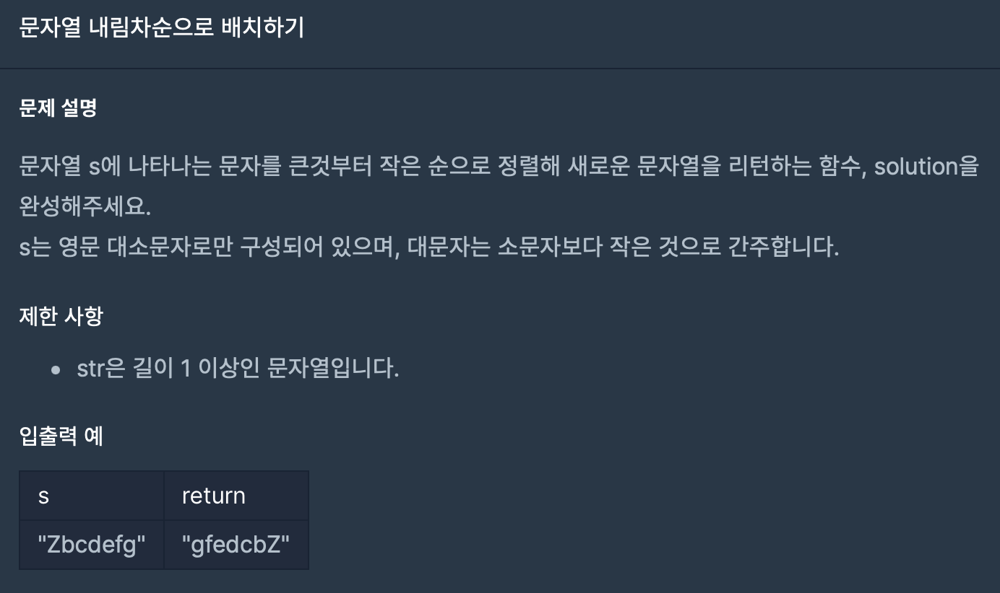

## 문제





문자열에 있는 문자를 큰 순서대로(아스키 코드) 재배치 하라는 문제 입니다.

## 코드

```python
def solution(s):
    return ''.join(sorted(list(s), reverse = True))
```

저도 처음으로 한줄 코딩을 해봤습니다.

문자열 s를 리스트로 만든 다음 **sorted()**와 **reverse = True**를 내림차순 정리를 했고

그 뒤에 앞에서 정리했던 join함수를 사용해서 다시 문자열로 합쳐줬습니다.

깔끔하죠? ㅎㅎ

## 얻어가는 것

### sorted()

sorted(iterable) 함수는 입력값을 정렬한 후 그 결과를 리스트로 돌려주는 함수입니다.

괄호 안에는 꼭 iterable 데이터가 와야합니다.

```python
>>> sorted([3, 1, 2])
[1, 2, 3]
>>> sorted(['a', 'c', 'b'])
['a', 'b', 'c']
>>> sorted("zero")
['e', 'o', 'r', 'z']
>>> sorted((3, 2, 1))
[1, 2, 3]
```

리스트 자료형에도 sort 함수가 있지만 sort 함수는 

리스트 객체 그 자체를 정렬만 할 뿐 정렬된 결과를 돌려주지는 않는다는 차이가 있습니다.
