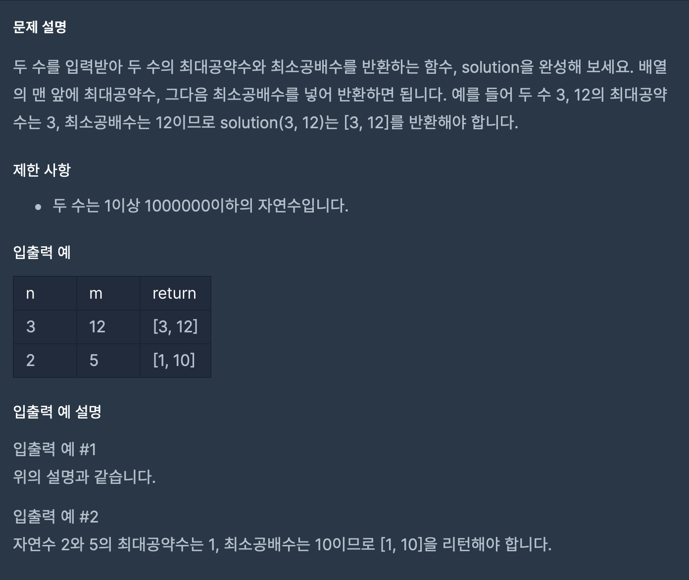

## 문제




두 수의 최대공약수, 최소공배수를 구해서 1x2로 반환해야하는 문제입니다.


## 코드

```python
def solution(n, m):
    answer = []
    a = []
    # 최대공약수
    for i in range(1,max(n,m)+1):
        if n%i==0 and m%i==0:
            a.append(i)
    answer.append(max(a))
    
    for i in range(max(n,m),n*m+1):
        if i % n == 0 and i % m == 0:
            answer.append(i)
            break
        
        
    return answer
```

사실 이번문제는 꽤 많이 틀렸습니다..

일단 최대공약수를 구하기 위해서 max(m,n)+1을 통해 큰 수만큼 for문을 돌려줬습니다. 

그리고 그 수를 n과 m에 나누고 나머지가 0인 i를 a 배열에 다 넣어주고 max(a)를 사용해서 

큰값을 answer 배열에 넣었습니다.


다음은 최소공배수 입니다. 일단 n*m이 나올수 있는 가장 큰 수익 max(n,m)이 나올수 있는 가장 작은 수이므로

Max(n,m)부터 n*m+1까지 for문을 돌려줬습니다.

그러면 작은수부터 i에 들어가져서 n과 m으로 나누어줄텐데 여기서 처음으로 조건에 충족되는 수가

바로 최소공배수 이므로 answer에 바로 append 해주고 break를 걸어줬습니다.

다른 분들의 코드를 봐볼까요.

```python
def gcdlcm(a, b):
    c, d = max(a, b), min(a, b)
    t = 1
    while t > 0:
        t = c % d
        c, d = d, t
    answer = [c, int(a*b/c)]

    return answer
```

사실 한번에 이해 하기가 어려워서 다른 사람들의 댓글을 참고 했더니

**유클리드 호제법**이라는 것을 사용했다고 하더라구요 그래서 

밑에서 유클리드 호제법이라는 것에 대해서 알아보겠습니다.

## 얻어가는 것

### 유클리드 호제법

유클리드 호제법은 최대공약수를 구하는 알고리즘의 하나입니다.

호제법이란 말은 두 수가 서로 상대방 수를 나눠서 결국 원하는 수를 얻는 알고리즘을 말합니다.

#### 최대공약수

```python
def gdc(x, y):
    while y > 0:
        x, y = y, x % y
    return x
```

코드를 보면 비교적 간단합니다. 

증명과정을 참고했더니 이해가 간단합니다.

사실 어느정도 외우고 있어야 할 것 같습니다.

결국 y가 0이 되면 x에는 최대공약수가 남습니다.

#### 최소공배수

```python
def lcm(x, y):
    return x * y // gdc(x, y)
```

최소 공배수는 더욱 간단합니다.

앞에서 구한 최대공약수를 두 수의 곱에 나눠버리면 됩니다.

정말 쉽고 최대공약수, 최소공배수를 구할 수 있는 방법이 있었네요!

