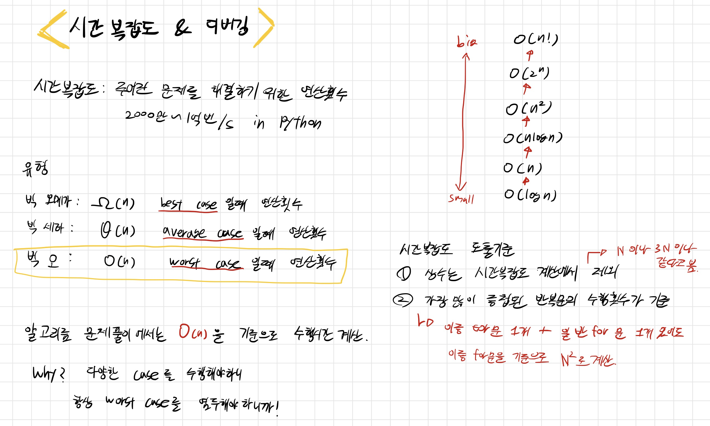
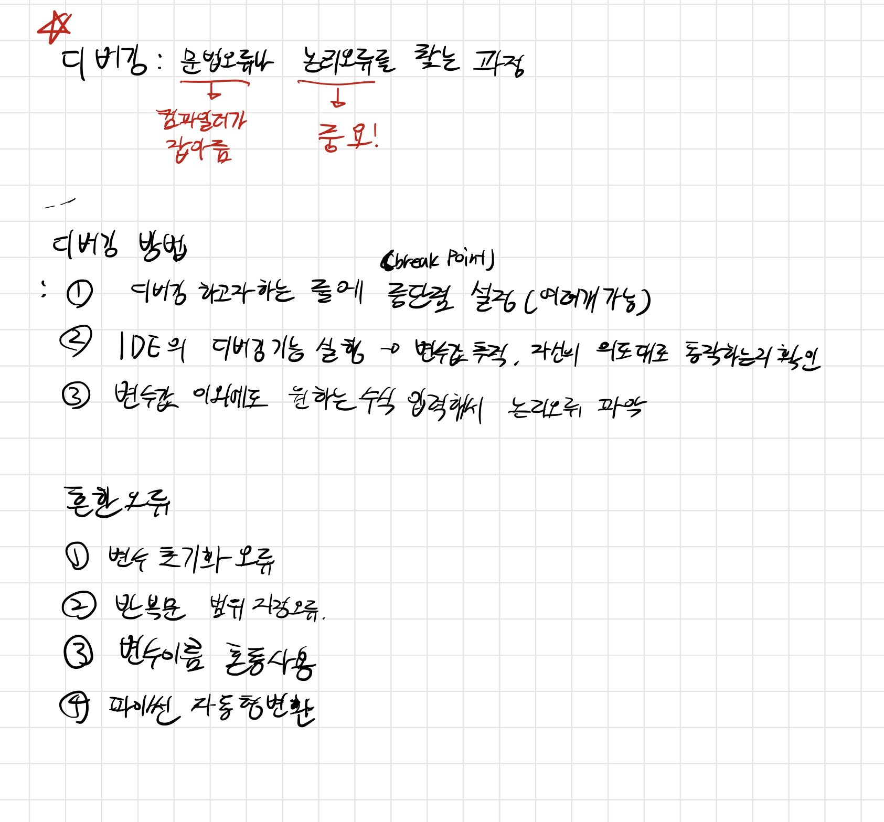

# 시간복잡도와 디버깅

코딩 테스트를 할 때 중요한 시간복잡도와 논리오류를 잡아줄 수 있는 디버깅에 대한 내용입니다.

사실 지금까지는 시간 복잡도를 많이 생각을 안하고 코드를 작성했는데 점점 어려운 문제가 나올 수록 중요해지겠죠?

평소 코딩 테스트를 연습할 때 디버깅 하는 습관을 들여 놓는다면 시험장에서 아쉽게 실수하는 경우가 줄어들 것 같습니다!
