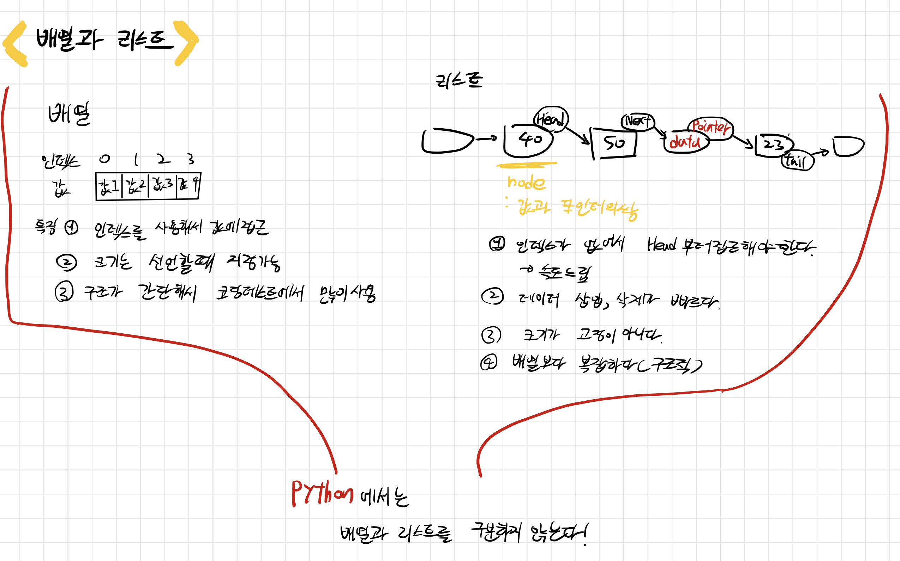
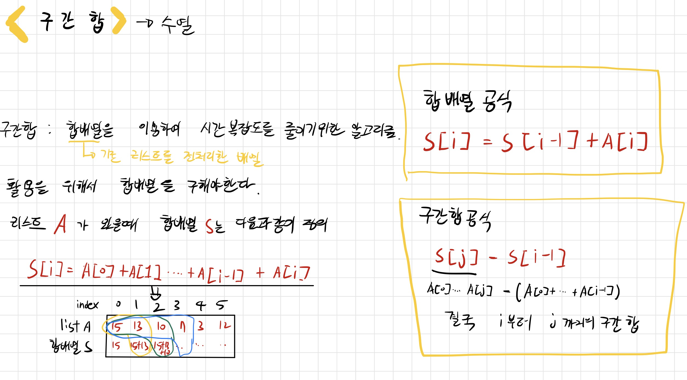

# 배열과 리스트, 구간 합

## 개념

Python에서 리스트는 배열과 리스트의 특징을 모두 가지며 배열과 리스트는 따로 구분하지 않는다!

시간복잡도를 줄이기 위해서 구간합 알고리즘을 사용한다. 

그냥 고딩때 수열의 합 구했던 과정을 생각하면 편하다.

## BOJ 문풀

### 배열과 리스트

11720번(숫자합)

1549번(평균구하기)

### 구간 합

11659번(구간합구하기1)

11660번(구간합구하기2)

10986번(나머지합구하기)

