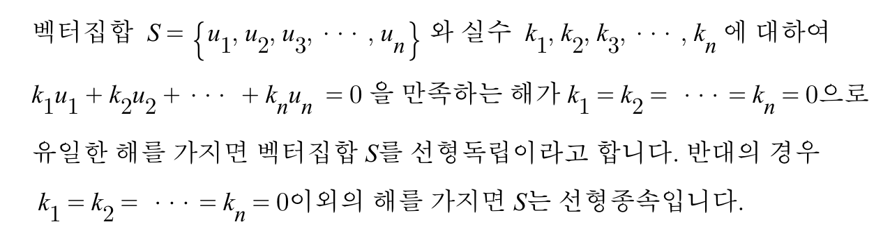
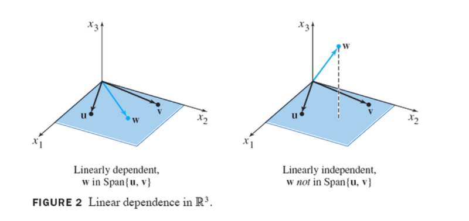

# 선형종속과 선형독립

**선형독립(linearly independent)**과 **선형종속(linearly dependent)**은 선형대수학에서 가장 기본이 되는 개념이라고 할 수 있습니다.

## 1. 정의

선형독립과 선형종속의 정의 입니다.

정리해보면 k1부터 Kn이까지 모두 0으로 갖는게 유일한 해라면 **선형독립**

그 이외의 해를 갖는다면 **선형종속**

위의 말을 약간 바꿔보자면

### 선형독립(linearly independent)이란

① 벡터집합 S의 어떠한 원소도 나머지 원소들의 선형결합으로 나타낼 수 없습니다.

​     **즉, 각각의 벡터는 서로 독립적으로 존재한다고 할 수 있습니다.**

그렇다면 

### 선형종속(linearly dependent)이란

② 벡터집합 S의 원소 중 **적어도** 하나는 나머지 원소들의 선형결합으로 나타낼 수 있습니다.

​     **즉, 어떠한 특정 벡터가 나머지 벡터에 의존하여 영향을 받는다고 할 수 있습니다.**

그림으로 보겠습니다.

그림으로 보니 조금 더 직관적으로 이해가 가능합니다.

### span

**span** 이라는 말이 강의 중에 계속 언급되는데  

**span**은 주어진 **벡터들의 선형결합으로 나타낼 수 있는 공간의 집합**를 말합니다..

예를들어 span(a,b) = 2차원 실수집합 일 경우 2차원 실수집합안에 있는 어느 벡터라도

두 벡터 a,b의 선형 결합으로 만들 수 있다는 이야기 입니다.

## 2. 예제

간단한 예제를 살펴보겠습니다.

R2에서 두 벡터가 동일선상에 있다 -> **선형종속**

R3에서 어떤 벡터가 두 벡터와 동일 평면상에 존재한다(즉, 두 벡터로 다른 하나의 벡터를 만들수 있다) -> **선형종속**

S ={[1,-1,2],[2,1,3],[-1,0,2]} 일때 span(S) = R3 인가? (즉, 선형독립인가?)

Sol) 

a = [1,-1,2]

b = [2,1,3]

c = [-1,0,2] 라고 할 때

C1 a + C2 b + C3 c = 영벡터

이 식을 계산해서 해를 구하면 C1 = C2 = C3 = 0가 유일한 해 이다.

그러므로 세 벡터는 **선형독립**이며 **span(S) = R3** 이다.

