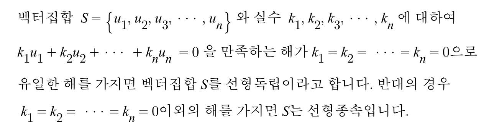
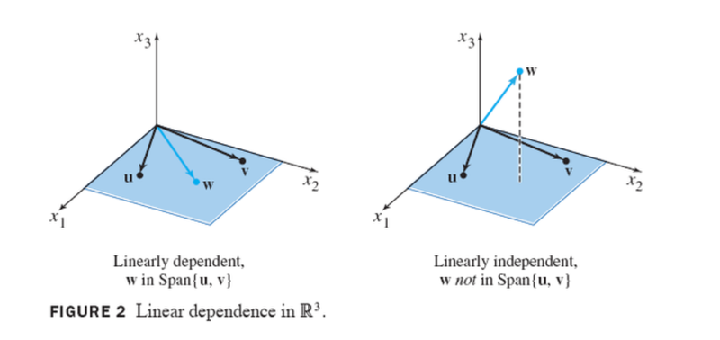

---
​---
title : "[칸아카데미] 모두를 위한 선형대수학 - 선형종속과 선형독립"
categories :
    - Linear Algebra
tag :
    - Linear Algebra
toc: true
toc_sticky : true
comments : true
sidebar_main: true

​---
---

# 선형종속과 선형독립

**선형독립(linearly independent)**과 **선형종속(linearly dependent)**은 선형대수학에서 가장 기본이 되는 개념이라고 할 수 있습니다.

## 1. 정의

선형독립과 선형종속의 정의 입니다.

위의 말을 이해하기 쉽게 바꿔보자면

**선형독립**이란

① 벡터집합 S의 어떠한 원소도 나머지 원소들의 선형결합으로 나타낼 수 없습니다.

​     **즉, 각각의 벡터는 서로 독립적으로 존재한다고 할 수 있습니다.**

그렇다면 **선형종속**이란

② 벡터집합 S의 원소 중 적어도 하나는 나머지 원소들의 선형결합으로 나타낼 수 있습니다.

​     **즉, 어떠한 특정 벡터가 나머지 벡터에 의존하여 영향을 받는다고 할 수 있습니다.**

글로만 읽으면 점점 헷갈리기 시작합니다.. 

그림으로 보겠습니다.

