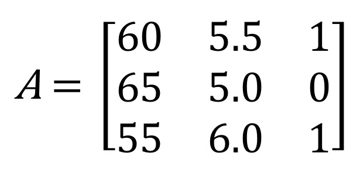

# 선형결합과 선형방정식

## 선형과 선형결합

선형이라는 말이 앞에 계속 붙어서 선형이라는 말을 이해하고 가야합니다.

먼저 **선형(linear)**이란 집합 A의 원소들에 대하여 선형결합(linear combination)의 형태로 나타낼 수 있는 것을 말합니다.

그렇다면 **선형결합**이란 무엇이냐면

집합 A의 원소 x1,x2,⋯,xn에 각각 상수 a1,a2,⋯,an을 곱하여 더한 a1x1+a2x2+⋯+anxn = b

 대응하는 계수와 변수를 곱하여 모두 합한 값을 **선형결합(linear combination)**이라고 합니다.

 

이렇게만 설명하면 제대로 와닿지 않을 수도 있으니 비선형(nonlinear)과의 비교를 통해서 알아보겠습니다.

| **선형(linear)**                 | **비선형(nonlinear)**              |
| -------------------------------- | ---------------------------------- |
| 1차식 또는 1차함수               | 2차 이상의 함수나 cos(x) 등의 함수 |
| 하나의 원인에 하나의 결과가 대응 | 복잡함                             |
| 직선 그래프                      | 곡선 그래프                        |
| 행렬로 표현 가능                 | 행렬로 표현 불가능                 |
| 속도와 거리 관계 등              | 카오스 등의 자연현상               |

이렇게 이해하니 선형과 비선형의 차이가 뭔지 직관적으로 알 수 있습니다.

## 선형 방정식

다음 알아볼 것은 변수 x1,x2,⋯,xn과 계수 a1,a2,⋯,an에 관한 **선형방정식(linear equation)**입니다.

a1,a2,⋯,an 즉, 계수들은  정해져있으며

위의 식에서 등식을 성립시키는 변수 x1,x2,⋯,xn이 값들을 해(solution)라고 합니다.

 여러 개로 이루어진 선형방정식은 **선형시스템(linear system)**이라고 합니다.

선형 시스템 중 하나의 예시 입니다.

 

이 식을 우리는 계수들이 모인 행렬 A와 변수들이 모인 벡터 X로 표현이 가능합니다.

이처럼 계수들을 행렬로 표현이 가능합니다.

이처럼 변수들을 벡터 X로 표현이 가능하고 b값도 X와 같은 차원의 벡터로 표현이 가능합니다.

사실 이 선형방정식과 선형시스템을 풀어서 해를 구하는 과정은 여러가지 입니다.

보통 가우스 소거법 이라는 방법을 많이 사용하고 역행렬을 구해서 하기도 합니다.

물론 역행렬을 구하는 것 또한 가우스 소거법을 사용해서 합니다.

제가 학교에서 많이 했었는데 공학용 계산기나 컴퓨터로 계산이 너무 편리해서 당장은 다루지 않겠습니다....ㅜㅜ

그래도 해를 구하는 예시를 하나 보자면

행렬 A의 역행렬을 구해서 양쪽에 행렬곱을 해주면서

해를 구할 수 있게 됩니다. 

나중에 역행렬에 대한 부분은 따로 다루도록 하겠습니다.

아무튼 

다시 돌아와서 만약 b1=b2=⋯=bm=0일 경우 위 식을 homogeneous system이라고 합니다.

앞으로의 내용에서 homogeneous system을 많이 만나게 됩니다.

이 때, x1=x2=⋯=xn=0은 항상 해가 되는데 이를 trivial solution이라고 합니다.

그리고 x1,x2,⋯,xn 중 어느 하나라도 0이 아닌 경우의 해를 nontrivial solution이라고 한다. 

이 부분은 선형 결합과 선형 종속에서도 비슷한 내용을 다룹니다.

역행렬, 단위행렬 같은 부분은 추후에 다루도록 하겠습니다!!