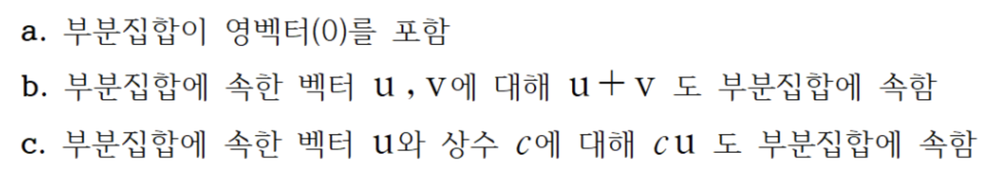
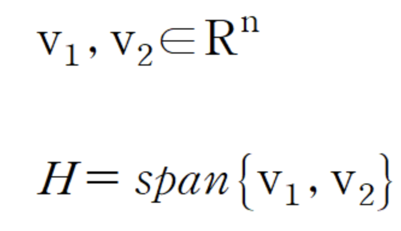
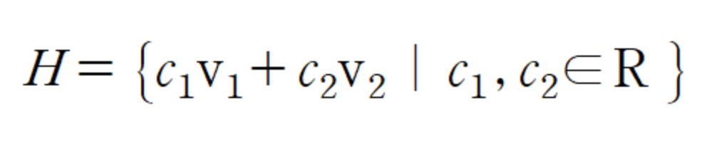
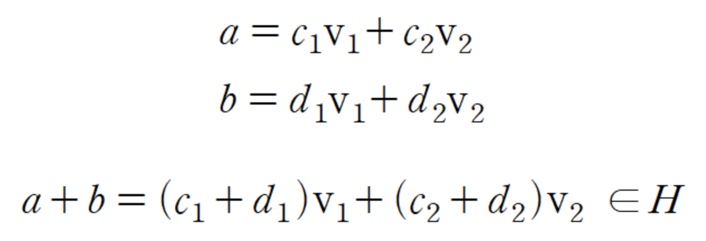
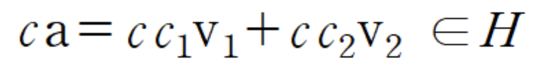
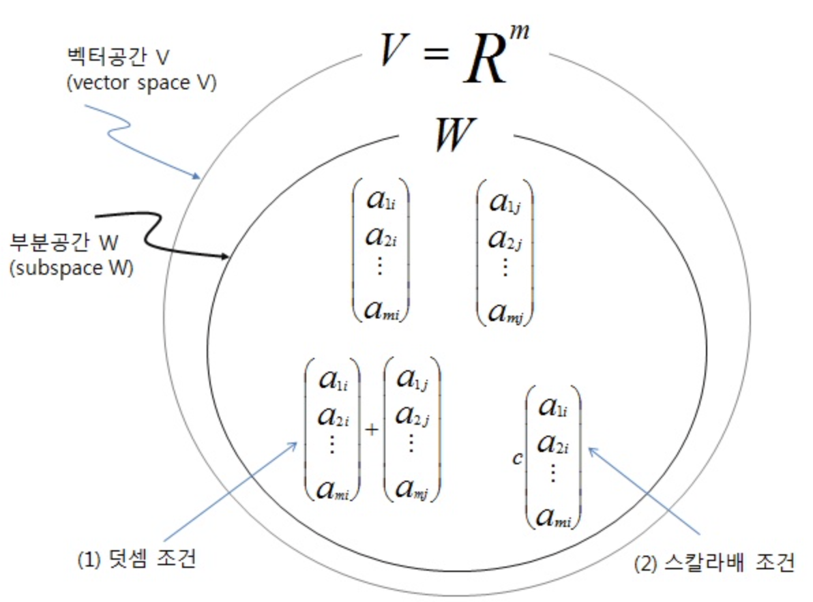
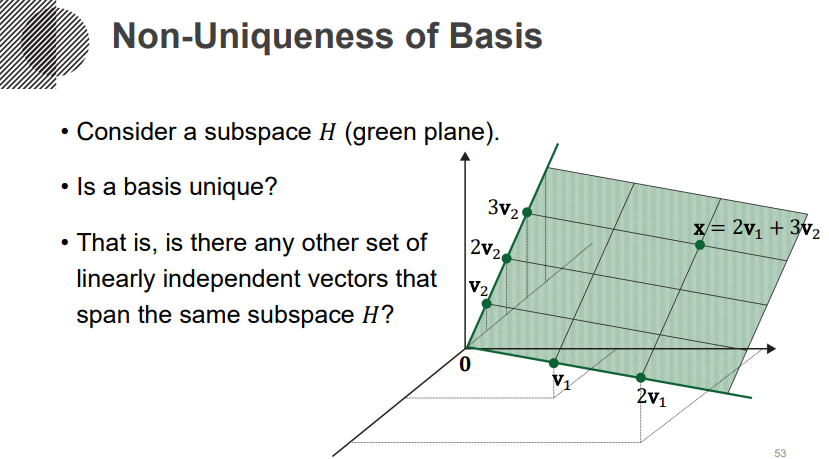

# 부분공간(Subspace) 기저(Basis)

**부분공간**과 **기저**의 개념에 대해서 알아보겠습니다.

이 두 개념은 앞서 다룬 **선형결합**과 **선형독립**, **Span**을 이해해야 알 수 있고

앞의 개념과 마찬가지로 선형대수학에서 기본이 되는 개념입니다.

## 부분공간

부분공간은 결론적으로는 앞서 언급한 **Span**과 비슷합니다. 

R3의 부분집합을 생각해보면 점도 가능하고 평면도 가능하고  R3 전체도 가능합니다.

부분공간은 이러한 집합에서 조건을 추가한 것 입니다. 

아래 보이는 3개의 조건이 그 조건 입니다.

위의 조건을 간단 정리하면 

**영벡터를 포함하며 선형결합에 닫혀있어야한다**

**(부분공간내의 벡터들을 아무리 선형결합해서 새로운 벡터를 만들어내도, 그건 다시 부분공간안의 어떤 벡터이다)** 

라는 말 입니다.

또한 중요한 것은 벡터들의 **Span**이 **부분공간**이 된다는 것 입니다.

H가 v1과 v2의 Span으로 정의될 때

Span는 벡터들의 선형결합이므로 H가 이런식으로 표현될 수 있습니다.

C1 , C2가 0일때 영벡터이니 당연히 영벡터를 포함합니다. (조건 a)

또한, H의 두 벡터 a,b의 합 또한 H에 포함됩니다. (조건 b)

당연하게도, H에 포함된 a의 스칼라곱 또한 H에 포함됩니다. (조건 c)

따라서 span으로 정의된 H는 Rn의 부분공간이 됩니다.

벤다이어 그램으로 정리한다면 이런 그림이 되겠습니다.

## 기저

앞선 내용을 통해 부분공간에 대해서 알아보았는데

이번에는 그 부분공간을 형성하는 기저에 대해서 알아보겠습니다.

간단하게, 부분공간 H을 형성하는 집합 중 원소의 개수가 최소인 것을 기저라고 합니다.

기저는 다음 두가지 조건을 만족해야합니다.

**a. 선형독립(linear independent)**

**b. 기저들이 H를 Span(생성) 할 것**

이 두가지 조건을 만족하는 집합을 H의 기저라고 합니다.

기저의 개수가 하나라고 착각할 수 있는데

기저는 **유일하지 않습니다**. 

아래 그림상의 초록색 평면을 부분공간이라고 할 때, 저런 평면을 Span할 수 있는 벡터 2개의 조합이 1개 뿐이 아니라 매우 다양하기 때문입니다

.

하지만,**기저를 구성하는 벡터의 개수는 한정**되어있습니다.

이건 차원과 관련해서 설명할 수 있습니다.

기저를 구성하는 벡터의 개수는 **부분공간의 차원(Dim)수**와 같게됩니다.

또한, 이런 기저를 구성하는 가장 단순한 벡터도 알 수 있습니다.

2차원을 기준으로하면, [1,0] 과 [0,1]이 되며

3차원을 기준으로 하면 [1,0,0] [0,1,0] [0,0,1] 이 됩니다.

 이런 벡터들을 표준벡터(Standard vector)라고 칭합니다.