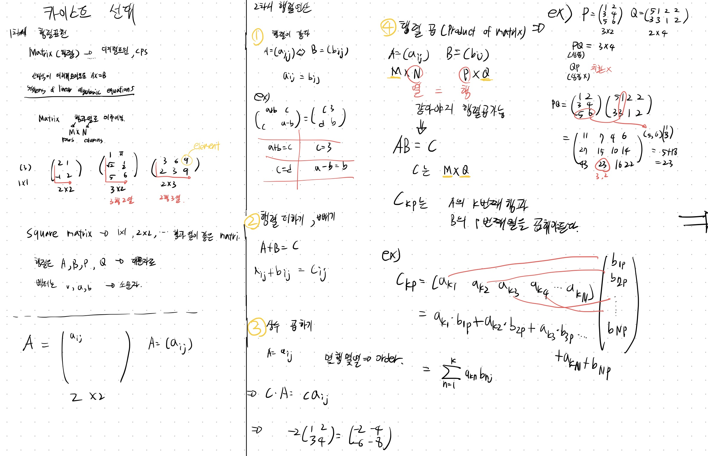
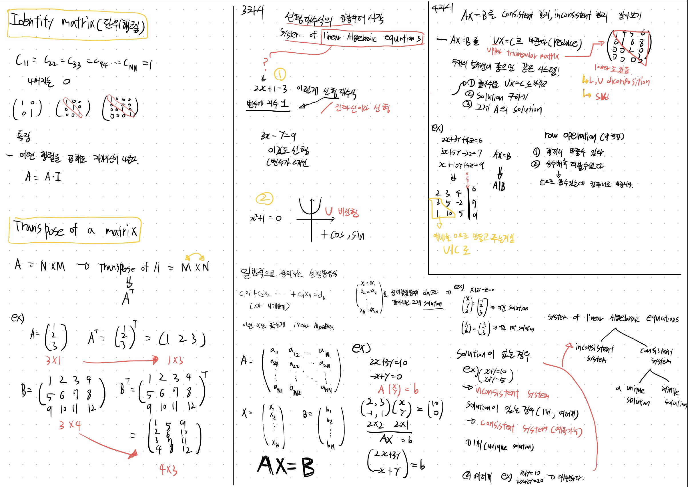
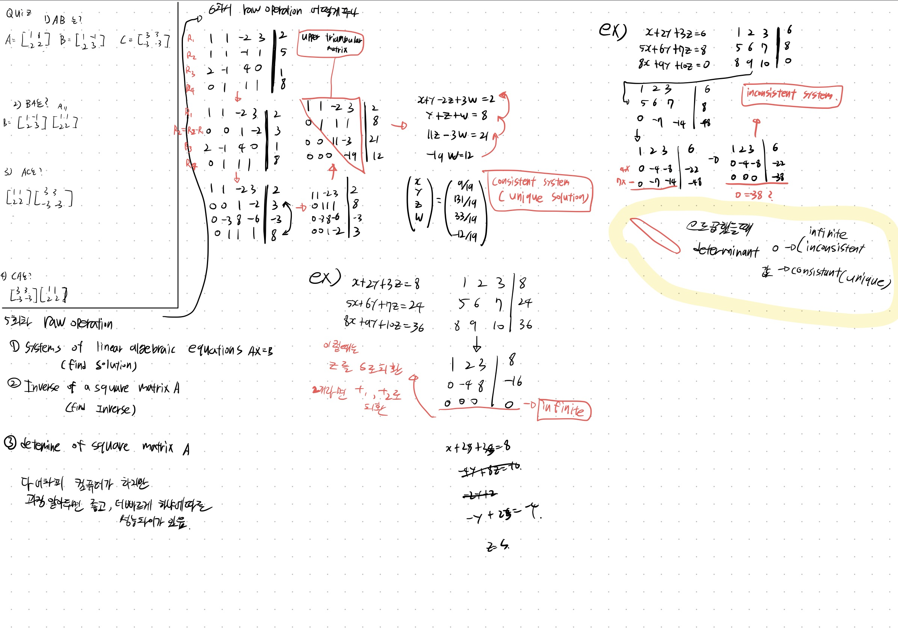
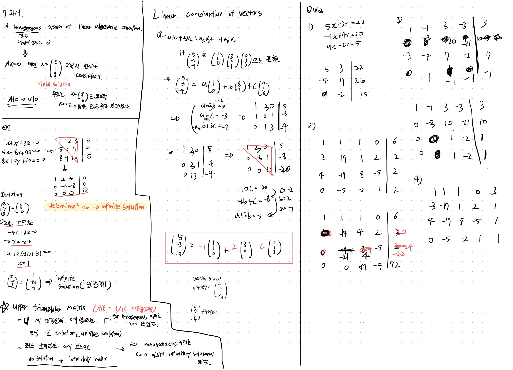
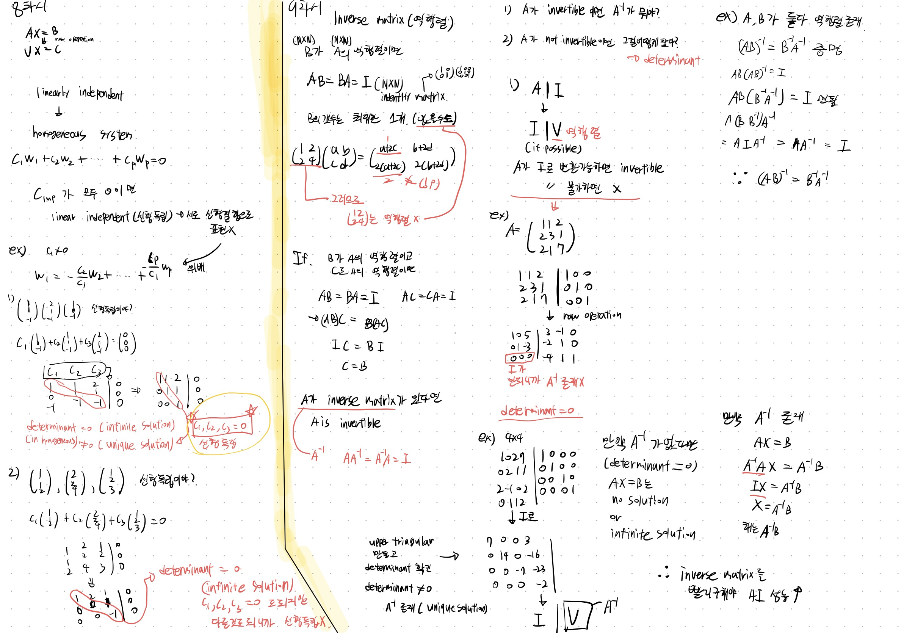
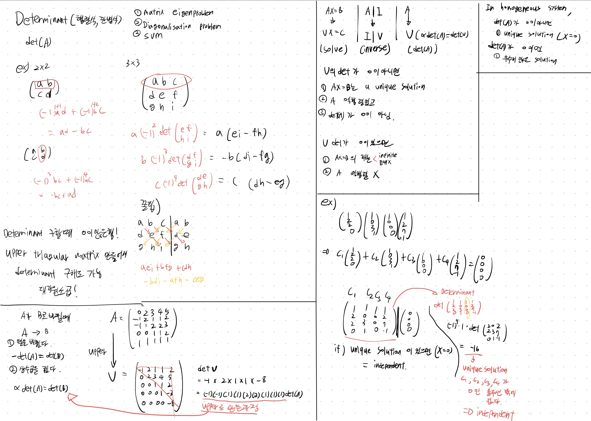
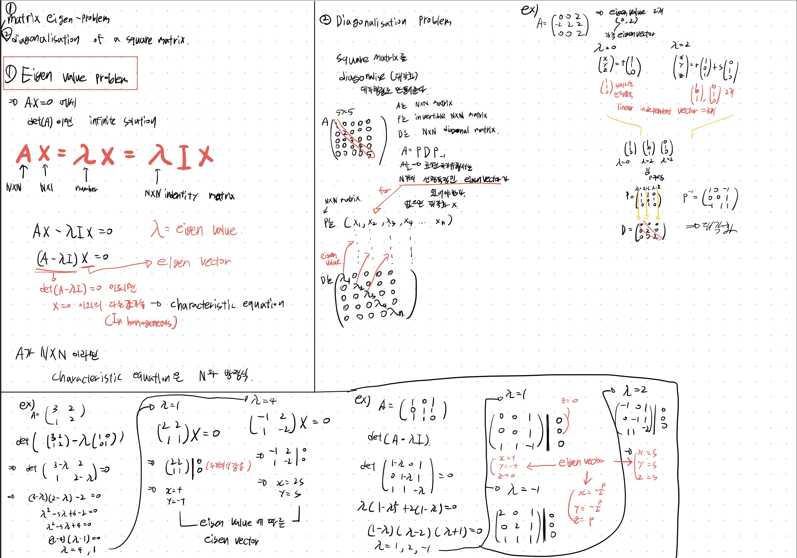
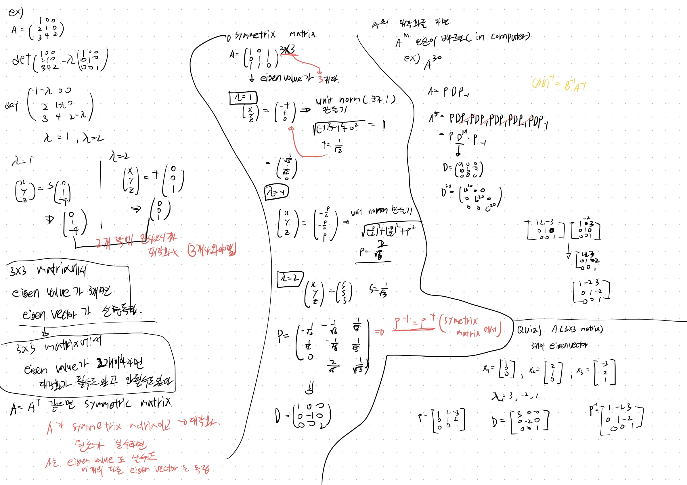

# AI를 위한 선형대수학

일단 블로그에 잘 올리고 싶지만 시간을 너무 많이 쓰게되어서 필기부터 올리고 차근차근 포스팅 하겠습니다!

## Matrix

## Identify Matrix, Transpose Matrix

## Linear equaion, Raw operation

## Linear Combination

## Linear independent, dependent, Inverse Matrix

## Determinant

## Eigen Value problem, Diagonalisation Problem

