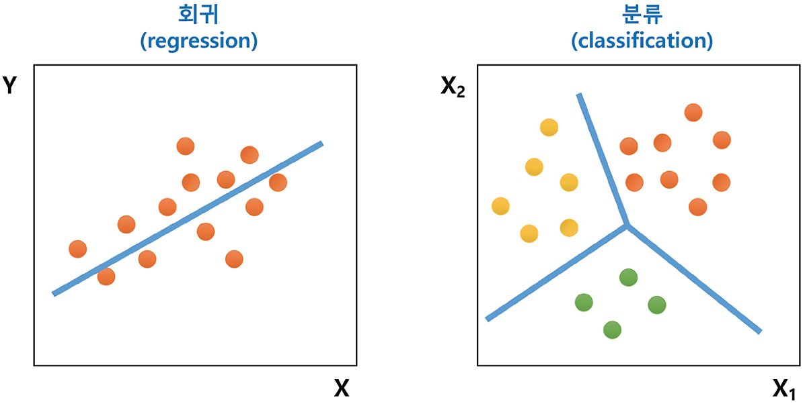
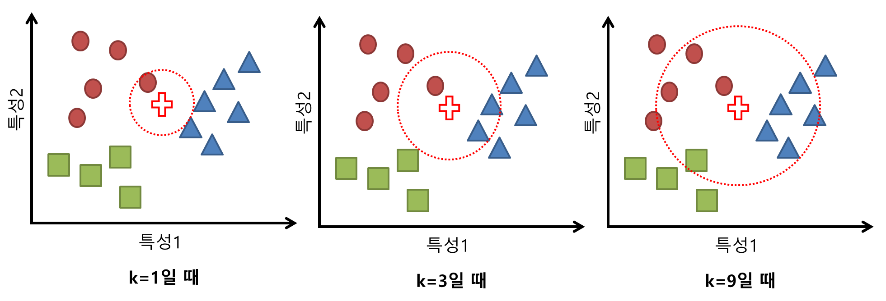
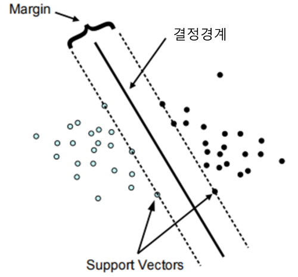
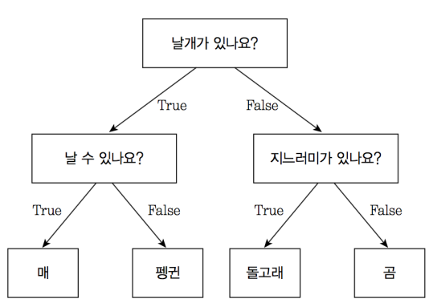

# [Machine Learning] - Supervised Learning

Machine Learning의 방법은 

Supervised Learning(지도학습), Unsupervised Learing(비지도학습), Reinforcement Learning(강화학습)

이렇게 크게 3가지로 나눌 수 있습니다.

이 3가지중 Supervised Learning에 대해서 알아보겠습니다.

## Supervised Learning(지도학습)

정답(lable)을 컴퓨터에게 알려주고 데이터를 학습시키는 방법입니다.

Supervised Learning에는 분류(classification)와 회귀(regression)가 있습니다.

### Classification(분류)

위의 그림에서 보다시피 

Classification은 주어진 데이터를 정해진 범주에 따라 분류하는 것이고

그 이후 새로운 데이터가 들어왔을 때 어디에 속할지 예측할 수 있습니다.(결과값이 정해져있음)

결국 Classification은 섞여 있는 데이터들 중에서 목표 레이블을 가장 잘 구분할 수 있는 경계를 나타내는 함수식을 찾는 것 이라고 할 수 있습니다.

(Ex. 학습 데이터를 A,B,C 중 한 그룹으로 매핑, 스팸 메일 필터링)

또한 이산형 데이터를 다룹니다.

Classification에는 이진분류(binary classification) 다중분류(multi classification)가 있는데

Hyperparameter에 따라서 바뀝니다.

(Ex 개 또는 고양이를 찍은 사진을 읽어서 개(클래스 0)인지 고양이(클래스 1)인지 분류하는 문제는 binary classification

​		 0~9 중에 하나의 숫자를 기록한 숫자 카드를 읽어서 어떤 숫자인지 판독하는 문제는 multi classification )

### Regression(회귀)

회귀란 변수가 두 개 주어졌을 때 한 변수에서 다른 변수를 예측하거나 두 변수의 관계를 규명할 때 사용합니다.

사용되는 변수 유형은 독립변수, 종속 변수가 있습니다. 

독립변수는 예측변수라고도 하며 영향을 미칠 것으로 예상되는 변수 입니다.

종속변수는 기준변수라고도 하며 영향을 받을 것으로 예상되는 변수 입니다.

일반적으로 사용되는 x와 y를 보면 x는 독립변수이며 y는 종속 변수입니다.

데이터의 특성(feature)을  기준으로 연속된 값을 그래프로 표현할 수 있습니다.

또한 특정 패턴이나 트렌드를 예측할 때 사용합니다.(결과 값이 정해져있지 않음)

결국 Regression은 데이터의 분포를 가장 잘 설명할 수 있는 X, Y 사이의 함수식을 찾는 것이라고 할 수 있습니다.

(Ex 주가 분석 예측)

또한 연속형 데이터를 다룹니다.

## Supervised Learning Algorithm

Supervised Learning을 할 수 있는 알고리즘들을 간단히 소개해 보도록 하겠습니다.

K-NN, SVM, logistic regression, linear regression, dicision tree 등이 있습니다.

### K-NN(K-Nearest Neighbor)

K-NN은 데이터를 가장 가까운 속성에 따라 분류하여 레이블링을 하는 모델 입니다.

K-Nearest Neighbor의 줄임말인데, 말 그대로 K개의 가까운 이웃의 속성에 따라 분류할 수 있습니다.

과거 데이터를 사용하여 미리 분류 모형을 만드는 것이 아니라

과거 데이터를 저장해두고 필요할 때마다 비교를 수행하는 방식입니다.

KNN 알고리즘은 테스트 데이터를 기준으로 가상의 원을 확장시켜나갑니다.

 그러다 K만큼의 학습 데이터를 만나게 되면 그때 그 학습 데이터들의 클래스를 확인해서

 과반수가 속하는 클래스를 테스트 데이터의 클래스로 분류합니다.

K 값에 따라서 Classification 결과가 달라질 수 있으니 K 값 설정을 유의해야 합니다.

(K = hyperparameter)

K-NN은 직관적이며 사용하기 쉽기 때문에 초보자들이 사용하기 좋으며 훈련데이터를 충분히 확보할 수 있는 환경에서 사용하는 것이 좋습니다.

### SVM(Support Vector Machine)

Support Vector Machine은 Classification을 위해 기준선을 정의하는 모델입니다.

SVM은 커널(kernel)만 적절히 선택한다면 정확도가 상당히 높기 때문에 

정확도를 요구하는 분류 문제를 다룰 때 사용하면 좋습니다. 또한 텍스트 분류에도 많이 사용합니다.

분류하지 않은 새로운 데이터가 들어오면 결정경계(기준선)을 기준으로 경계의 어느 쪽에 속하는 지 분류 할 수 있습니다.

여기서 가장 중요한 것은 결정 경계 입니다.

SVM에 관한 자세한 설명은 추후 게시물에서 다루도록 하겠습니다.

### Dicision tree(결정 트리)

Dicision tree 또한 데이터를 Classification 하거나 결과값을 예측하는 분석 방법입니다.

이상치가 많은 값으로 구성된 데이터셋을 다룰 때 사용하면 좋습니다. 

또한 결정과정을 시각적으로 확인이 가능하기 때문에 머신러닝이 어떤 방식으로 의사결정 하는지 알고 싶을 때 유용합니다.

이렇게 결과 모델이 트리 구조이기 때문에 dision tree라고 합니다.

결정트리는

영역의 순도(homogeneity)는 증가하고

불순도(impurity),불확실(uncertainty)는 감소하는 방향으로 학습이 진행됩니다.

처음에 이 말만 들어서는 이해가 쉽지 않습니다.

순도를 계산하는 방법은 

엔트로피(entropy)를 이용하는 방법과 지니 계수(Gini index)를 이용하는 방법

이 두가지를 많이 사용합니다.

이 개념은 엔트로피(entropy)를 이해하면 이해가 빠릅니다.

추후 게시물에서 dicision tree를 다룰 때 자세히 설명하도록 하겠습니다.

### Logistic Regression(로지스틱 회귀)

Logistic regression은 분석 대상들이 두 집단 혹은 그 이상의 집단으로 나누어진 경우

어느 집단으로 분류 될수 있는지 문석하고 이를 예측하는 모형을 개발하는데 사용되는 통계 기법입니다

사건의 확률(0 or 1)을 확인 하는데 사용됩니다.(Ex 이 고객이 A제픔을 구매할지 여부)

주어진 데이터에 대한 확신이 없거나(분류결과에 대한 확신이 없을 때)

추가적으로 훈련 데이터셋을 수집하여 모델을 훈련시킬 수 있는 환경에서 사용하면 유용합니다.

따라서 종속변수의 값은 0과 1사이가 됩니다.(이진변수로 표현해야하기 때문에)

Logistic regression은 Maximum Likelihood를 사용합니다.

Mean squared를 사용하는 Linear regression과는 다릅니다.

내용이 상당히 많아서 추후 게시물에서 Logisic regression을 다뤄보도록 하겠습니다.

### Linear Regression(선형 회귀)

Linear regression은 독립변수를 사용해서 종속변수의 움직임을 예측하고 설명합니다.

독립변수는 x 하나 일수도 있고 x1,x2,x3... 처럼 여러 개 일수도 있습니다.

독립변수가 하나라면 simple linear regression이라고 하며 

여러 개라면 multiple linear regression이라고 합니다.

독립변수와 종속변수가 linear 할때 사용하면 유용합니다.

또한 복잡한 연산과정이 없어서 컴퓨팅 성능이 낮은 환경에서 사용하면 좋습니다.

## 마무리

Supervised Learning에는 여러가지 알고리즘들이 있습니다.

그 알고리즘을 수학적으로 접근해보니 더욱 잘 이해가 되었습니다.

ML/DL을 잘 이해하기 위해서 수학적 접근을 놓지지 말아야 겠다는 생각을 했습니다.

알고리즘 별로 부족한 설명은 따로 정리해서 게시물로 올리도록 하겠습니다!

