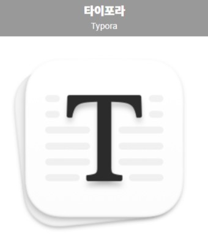

# Markdown(마크다운)이란?

마크다운은 마크업 언어의 일종으로 Github와 같이 공동으로 작업하기 위한 공간에서 많이 쓰이고 IT 업계에서 많이 쓰인다고 알고있습니다. 

또한 사용법이 간단하다.

저는 Git Blog를 작성하기 위해 Markdown 문법을 공부하게 되었는데 생각보다 이점이 많습니다.

Markdown의 장점을 알아볼까요?

## Markdown의 장점

- 문법이 쉽다
- 글을 쓰면 보기 좋게 정리된다

- 확장성이 좋다
- 공동작업이 편리하다
- 소스코드를 다루는데 편리하다


아직 Markdown을 많이 사용해보지 않았지만 웹서핑을 통해 사람들이 느끼는 장점들을 나열해보았습니다.

저도 이런 장점을 몸소 느낄 날을 기대하면서 Markdown 문법을 정리해보겠습니다.


# Markdown 문법

## 1) 강조

제목을 사용할  1~6단계로 조절이 가능합니다.


코드로는 이렇게 구현이 가능합니다.

```markdown
# hi
## hi
### hi
#### hi
##### hi
###### hi
```


글 중간에 강조하고 싶은 부분도  * 을 통해 강조가 가능하다.

나는 *바보* 다

```markdown
나는 *바보*다
```

나는 **바보**다

```markdown
나는 **바보**다
```

나는 ***바보***다

```markdown
나는 ***바보***다
```

나는 ~~바보~~다

```markdown
나는 ~~바보~~다
```


## 2) 인용문

인용문은 이런 방식으로 넣어 줄 수가 있습니다.

> 인용문
>
> > 인용문
> >
> > > 인용문

코드로는 이렇게 구현이 가능합니다.

```markdown
> 인용문
>
>> 인용문
>>
>>> 인용문
```


## 3) 리스트

*,- 로 사용이 가능합니다.

* 딸기
* 레몬
* 자몽
* 샤인머스켓

코드로는 이렇게 구현이 가능합니다.

```markdown
* 딸기
* 레몬
* 자몽
* 샤인머스켓
```


더 정리된 모습을 나타내기 위해서

- 과일
  * 딸기
  * 레몬
  * 자몽
  * 샤인 머스켓
   * 이나 - 앞에 띄어쓰기를 두번 해주면 더욱 정돈되게 리스트를 사용할 수 있습니다.


* 밥을 먹는 법
  1. 수저를 든다.
  2. 밥을 푼다.
  3. 입에 넣는다.


이렇게 순번으로도 정리가 가능합니다.

코드로는 이렇게 구현이 가능합니다.

```markdown
* 과일
  * 딸기
  * 레몬
  * 자몽
  * 샤인 머스켓
  
- 밥을 먹는 법
  1. 수저를 든다.
  2. 밥을 푼다.
  3. 입에 넣는다.
```


## 4) 코드블럭

코드블럭을 사용하기 위해서 억음부호를     ```를 입력하고 코드를 작성한 후 다시 억음 부호를 사용해서 아래와 같이 닫아주면 됩니다.

````python
```
a = hi
print(a)

```
````


## 5) 링크

링크는 다음과 같이 걸어줄 수 있습니다.

[naver](https://www.naver.com)

```markdown
[naver](https://www.naver.com)
```

또한 참조기능도 사용이 가능합니다.

```
[daum][daum-link]
[daum-linl]:https://www.daum.net/
```

이런 식으로 사용해줄 수가 있습니다.


## 6) 이미지

이미지도 링크와 비슷한 방식으로 넣어줄 수 있습니다.

```

```


또한 링크 거는 것과 비슷하게 참조도 가능합니다.

```
![logo][2]
[2]:(http://Yang-jaemin.github.io/images/yang-cho.JPG)
```

## 7) Typora

Markdown 파일은 여러 다양한 에디터를 사용해서 작성할 수 있습니다.

그중에서 저는 Tyopra라는 Markdown 에디터를 이용을 하고 있습니다!



마크다운 문법 적용된 것을 바로 확인 할 수 있고 이미지를 삽입하고 

좀 더 가독성 있게 글을 쓸 수 있다는 것이 장점 같습니다!

(유료입니다... 약 2만원..)


## 8) 마무리

이번 글에 소개해드린 것은 마크다운을 사용하기 위한 아주 기본적인 문법만을 소개해드렸습니다.

다음 글에는 표를 넣는 방법이나 다이어그램을 사용하는 것과 같은 

다른 기능을 정리 해보도록 하겠습니다.

이 글은 제가 Markdown을 사용하면서 꼭 필요하다 싶은 것들을 수정해나가도록 하겠습니다!

